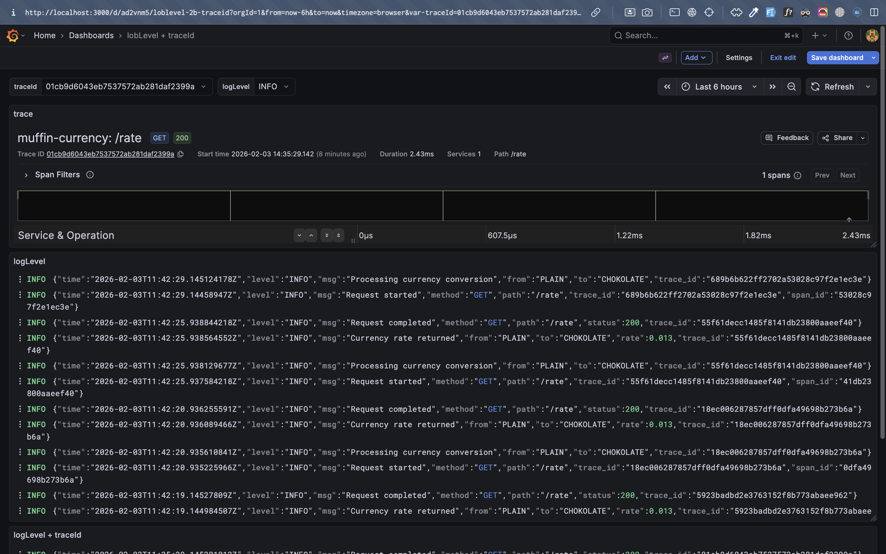
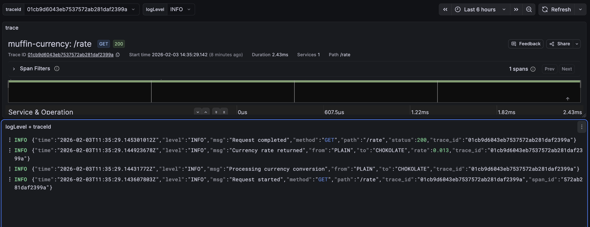

# Отчет о проделанной работе

## Содержание

1. [Что сделано](#что-сделано)
2. [Запуск проекта](#как-запустить-ваш-кластер-kubernetes-и-развернуть-приложение)
3. [Проверка работоспособности](#как-проверить-работоспособность-всех-компонентов-системы)
4. [Проверка данных](#проверка-данных)

## Что сделано

В рамках домашнего задания `ДЗ Логирование и трейсинг`:

1. было развернуто muffin-wallet приложение внутри кластера Kubernetes (minikube), использую helmfile
2. Была развернута база данных PostgreSQL
3. было развернуто muffin-currency приложение внутри кластера Kubernetes (minikube), использую helmfile
4. Обеспечен сбор логов из приложения muffin-wallet с помощью promtail и loki
5. Обеспечен сбор трейсов системы с помощью zipkin
6. Создан dashboard для просмотра результатов в grafana
7. Подготовлен отчет о проделанной работе

## Как запустить ваш кластер Kubernetes и развернуть приложение

Для запуска можно выполнить скрипт start.sh

```bash
sh ./start.sh
```

Также можно выполнить запуск самостоятельно, для этого необходимо сделать следующее:

- Запусть Postgres

    ```bash
    docker compose up -d
    ```

- Запустить minikube

    ```bash
    minikube start
    ```

- Подключить аддоны с ingress и metrics-server, если еще не были

    ```bash
    minikube addons enable ingress
    minikube addons enable metrics-server
    ```

- Включить prometheus CRD, если еще не был

    ```bash
    kubectl apply -f https://raw.githubusercontent.com/prometheus-operator/prometheus-operator/v0.68.0/example/prometheus-operator-crd/monitoring.coreos.com_servicemonitors.yaml
    ```

- Развернуть компоненты приложения

    ```bash
    helmfile sync
    ```

### Доступ к muffin-wallet

Для доступа к muffin-wallet необходимо сделать port-forward к его деплойменту

```bash
kubectl port-forward -n muffin deployment/muffin-wallet 8080:8081
```
теперь muffin-wallet доступен по ссылке [http://localhost:8080/swagger-ui/index.html](http://localhost:8080/swagger-ui/index.html)

### Создание нагрузки

Можно создать искуственную нагрузку для тестирования приложения, например:

```bash
for i in {1..50}; do
    curl -s "http://www.localhost:8080/v1/muffin-wallets?page=0&size=0" &
done
```

## Как проверить работоспособность всех компонентов системы

### Проверка muffin-wallet

```bash
# Получение имени пода
WALLET_POD=$(kubectl get pods -n muffin -l app=muffin-wallet -o jsonpath='{.items[0].metadata.name}')

# Проверка логов
kubectl logs -n muffin $WALLET_POD -c muffin-wallet

# Проверка статуса пода (Должно быть 2/2 Running)
# Т.к. promtail был встроен как sidecar для muffin-wallet
kubectl get pod -n muffin $WALLET_POD

# Проверка health endpoint 
kubectl port-forward -n muffin $WALLET_POD 8081:8081 &
PF_PID=$!
sleep 2
curl -s http://localhost:8081/actuator/health
kill $PF_PID
```

### Проверка muffin-currency

```bash
# Получение имени пода
CURRENCY_POD=$(kubectl get pods -n muffin -l app=muffin-currency -o jsonpath='{.items[0].metadata.name}')

# Проверка логов 
kubectl logs -n muffin $CURRENCY_POD -c muffin-currency

# Проверка статуса пода (Должно быть 2/2 Running)
# Т.к. promtail был встроен как sidecar для muffin-currency
kubectl get pod -n muffin $CURRENCY_POD

# Проверка health endpoint
kubectl port-forward -n muffin $CURRENCY_POD 8080:8080 &
PF_PID=$!
sleep 2
curl -s http://localhost:8080/rate?from=PLAIN&to=CHOKOLATE
kill $PF_PID
```

### Проверка мониторинга

```bash
kubectl get pods -n monitoring
```

## Проверка данных

### Запуск grafana

```bash
kubectl port-forward -n monitoring svc/grafana 3000:3000 
# Теперь можно открывать http://localhost:3000
# Данные для входа, логин: admin, пароль: admin
```

### Проверка

В dashboards мною был подготовлен dashboard с тремя панелями: показ данным traceId (может работать не со всеми traceId, т.к. некоторые из них отличаются от собранных Zipkin), показ логов по logLevel и показ логов по logLevel и traceId.



Как видно, traceId в обеих панелях соответствуют запрашиваемым


