# Отчет о проделанной работе

## Содержание

1. [Что сделано](#что-сделано)
2. [Запуск проекта](#как-запустить-ваш-кластер-kubernetes-и-развернуть-приложение)
3. [Проверка работоспособности](#как-проверить-работоспособность-всех-компонентов-системы)
4. [Просмотр метрик](#просмотр-собранных-метрик)

## Что сделано

В рамках домашнего задания `ДЗ Prometheus-1.pdf`:

1. было развернуто muffin-wallet приложение внутри кластера Kubernetes (minikube), использую helmfile
2. Была развернута база данных PostgreSQL
3. Был развернут Prometheus со сбором метрик muffin-wallet и PostgreSQL
4. Было развернуто постоянное хранение метрик в Victoria Metrics
5. Был написан и проверен ряд PromQL-запросов
6. Подготовлен отчет о проделанной работе

## Как запустить ваш кластер Kubernetes и развернуть приложение

Для запуска можно выполнить скрипт start.sh

```bash
sh ./start.sh
```

Также можно выполнить запуск самостоятельно, для этого необходимо сделать следующее:

- Запусть Postgres

    ```bash
    docker compose up -d
    ```

- Запустить minikube

    ```bash
    minikube start
    ```

- Подключить аддоны с ingress и metrics-server, если еще не были

    ```bash
    minikube addons enable ingress
    minikube addons enable metrics-server
    ```

- Включить prometheus CRD, если еще не был

    ```bash
    kubectl apply -f https://raw.githubusercontent.com/prometheus-operator/prometheus-operator/v0.68.0/example/prometheus-operator-crd/monitoring.coreos.com_servicemonitors.yaml
    ```

- Добавляем muffin-wallet.local в /etc/hosts

    ```bash
    sudo sh -c 'echo "192.168.49.2 muffin-wallet.local" >> /etc/hosts'
    ```

- Развернуть компоненты приложения

    ```bash
    helmfile sync
    ```

- Запустить Prometheus, VictoriaMetrics и экспортер Postgres

    ```bash
    cd prometheus && docker compose up -d && cd ..
    ```

### Доступ к muffin-wallet

Для доступа к muffin-wallet необходимо сделать port-forward к его деплойменту

```bash
kubectl port-forward -n muffin deployment/muffin-wallet 8080:8081
```
теперь muffin-wallet доступен по ссылке [http://localhost:8080/swagger-ui/index.html](http://localhost:8080/swagger-ui/index.html)

### Создание нагрузки

Можно создать искуственную нагрузку для тестирования приложения, например:

```bash
for i in {1..50}; do
    curl -s "http://www.localhost:8080/v1/muffin-wallets?page=0&size=0" &
done
```

## Как проверить работоспособность всех компонентов системы

### Проверка muffin-wallet

```bash
# Получение имени пода
WALLET_POD=$(kubectl get pods -n muffin -l app=muffin-wallet -o jsonpath='{.items[0].metadata.name}')

# Проверка логов
kubectl logs -n muffin $WALLET_POD -c muffin-wallet

# Проверка статуса пода (Должно быть 1/1 Running)
kubectl get pod -n muffin $WALLET_POD

# Проверка health endpoint 
kubectl port-forward -n muffin $WALLET_POD 8081:8081 &
PF_PID=$!
sleep 2
curl -s http://localhost:8081/actuator/health
kill $PF_PID
```

### Проверка muffin-currency

```bash
# Получение имени пода
CURRENCY_POD=$(kubectl get pods -n muffin -l app=muffin-currency -o jsonpath='{.items[0].metadata.name}')

# Проверка логов 
kubectl logs -n muffin $CURRENCY_POD -c muffin-currency

# Проверка статуса пода (Должно быть 1/1 Running)
kubectl get pod -n muffin $CURRENCY_POD

# Проверка healt endpoint
kubectl port-forward -n muffin $CURRENCY_POD 8080:8080 &
PF_PID=$!
sleep 2
curl -s http://localhost:8080/rate?from=PLAIN&to=CHOKOLATE
kill $PF_PID
```

### Проверка ServiceMonitor

```bash
# Проверка ServiceMonitor
kubectl get servicemonitor -n muffin

# Детальная информация
kubectl describe servicemonitor -n muffin muffin-wallet
```

### Проверка Prometheus

Он должен работать по умолчанию по адресу: [http://localhost:9090](http://localhost:9090)

В противном случае лучше посмотреть его состояние в docker, например:

```bash
docker ps | grep prometheus
```

Для проверки сбора метрик следует сделать следующее:

1. Открыть [http://localhost:9090](http://localhost:9090)
2. Перейти в **Status → Targets**
3. Убедиться, что все targets в статусе 'UP'

### Проверка Victoria Metrics

К ней можно получить доступ по ссылке [http://localhost:8428/](http://localhost:8428/)

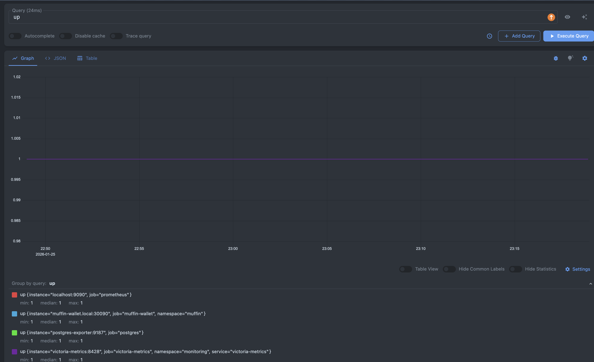

## Просмотр собранных метрик

### Проверить доступные метрики

Можно проверить какие метрики собираются в данный момент и период времени, в который каждые из представленных метрик собирались

1. Открыть вкладку **Graph**
2. В поле запроса ввести 'up' и выполнить **Execute**
3. На графике будет представлена когда и какие метрики были собраны


### Просмотр метрик приложения

Проверим сбор всех указанных в задание метрик

Если какой-то график почему-то пустой, следует открыть его настройки и убрать `Start Y axis at 0`

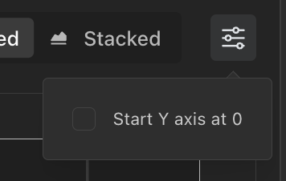

#### Количество запросов в секунду по каждому методу REST API вашего приложения

```promql
sum(rate(http_server_requests_seconds_count{job="muffin-wallet"}[1m])) by (method, uri)
```

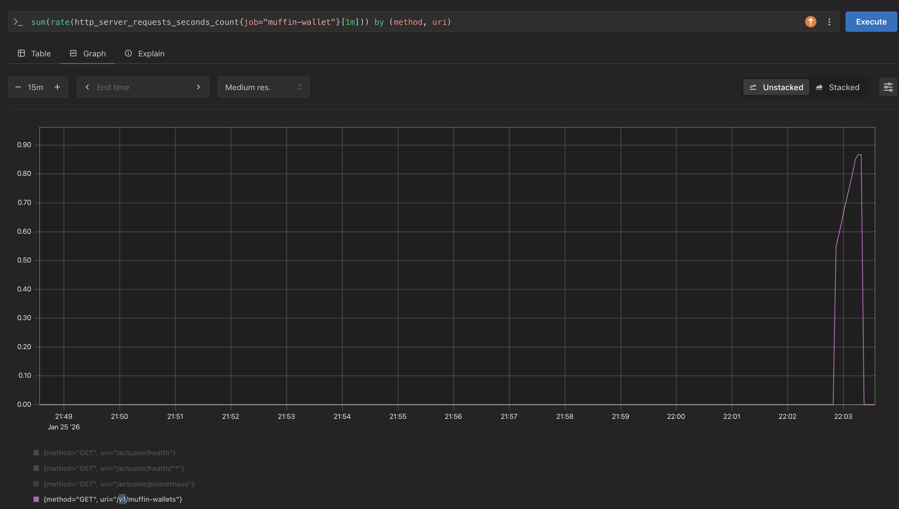

Именно в этот момент мною было отправлено множество запросов получения списка кошельков

Посмотреть результат можно сразу по ссылке [тык](http://localhost:9090/query?g0.expr=sum%28rate%28http_server_requests_seconds_count%7Bjob%3D%22muffin-wallet%22%7D%5B1m%5D%29%29+by+%28method%2C+uri%29&g0.show_tree=0&g0.tab=graph&g0.range_input=5m&g0.res_type=auto&g0.res_density=medium&g0.display_mode=lines&g0.y_axis_min=&g0.show_exemplars=0)

#### Количество ошибок в логах приложения

```promql
sum(increase(logback_events_total{job="muffin-wallet",level="error"}[1m]))
```

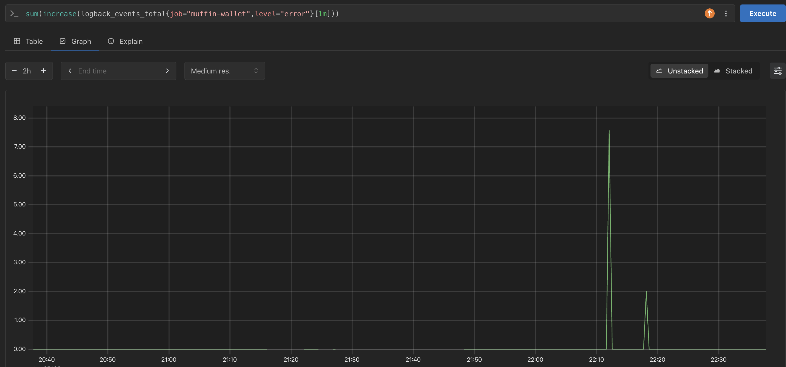

проверить запрос по ссылке [тык](http://localhost:9090/query?g0.expr=sum(increase(logback_events_total%7Bjob%3D%22muffin-wallet%22,level%3D%22error%22%7D%5B1m%5D))&g0.show_tree=0&g0.tab=graph&g0.range_input=2h&g0.res_type=auto&g0.res_density=medium&g0.display_mode=lines&g0.y_axis_min=&g0.show_exemplars=0)

Альтернативный вариант через HTTP статус коды

```promql
sum(rate(http_server_requests_seconds_count{job="muffin-wallet", status=~"5.."}[1m]))
```

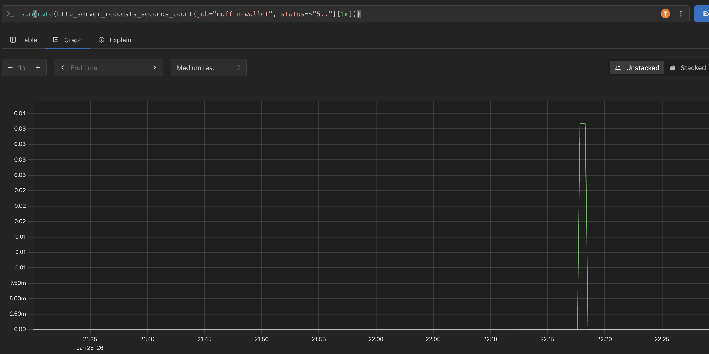

мною было отправлено 6 запросов на транзакции с кошельком не существующей валюты

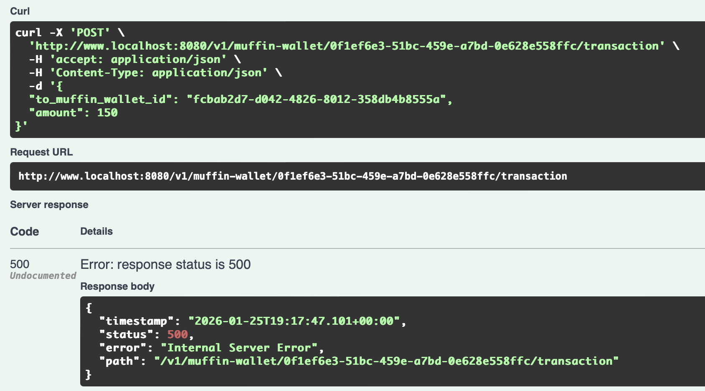

Посмотреть результат можно сразу по ссылке [тык](http://localhost:9090/query?g0.expr=sum%28rate%28http_server_requests_seconds_count%7Bjob%3D%22muffin-wallet%22%2C+status%3D%7E%225..%22%7D%5B1m%5D%29%29&g0.show_tree=0&g0.tab=graph&g0.range_input=2h&g0.res_type=auto&g0.res_density=medium&g0.display_mode=lines&g0.y_axis_min=&g0.show_exemplars=0)

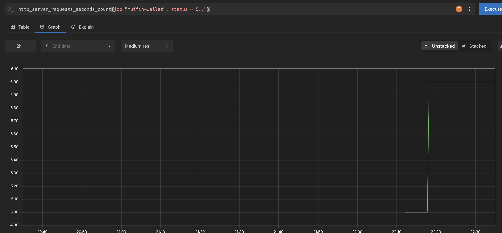

Как видно, количество запросов соответствует 6-ти моим отправленным

### 99-й перцентиль времени ответа HTTP (обработка запросов)

```promql
histogram_quantile(0.99, sum(rate(http_server_requests_seconds_bucket{job="muffin-wallet"}[1m])) by (le, method, uri))
```

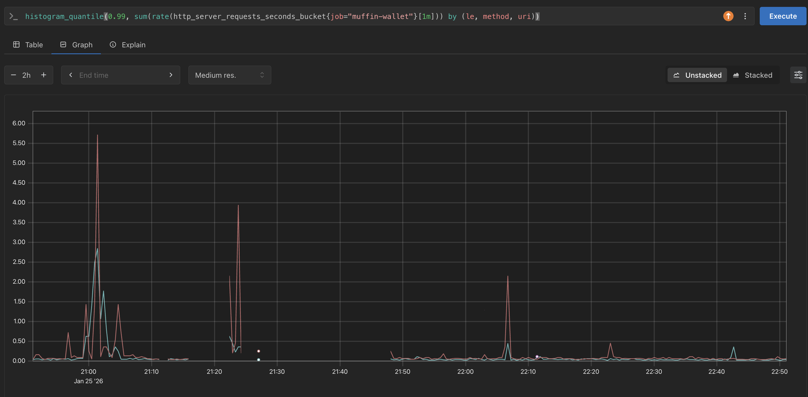

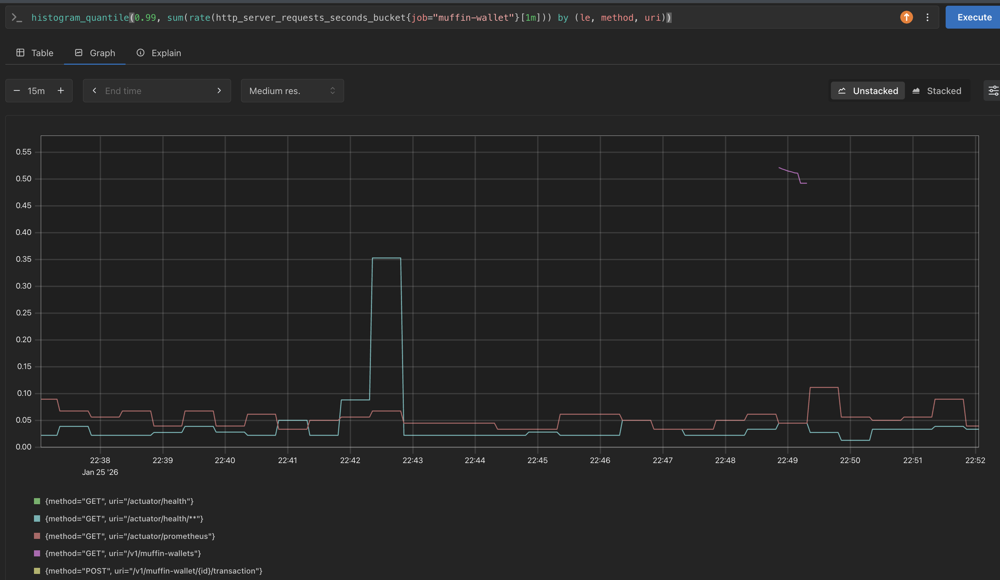

Запрос можно открыть по ссылке [тык](http://localhost:9090/query?g0.expr=histogram_quantile(0.99,+sum(rate(http_server_requests_seconds_bucket%7Bjob%3D%22muffin-wallet%22%7D%5B1m%5D))+by+(le,+method,+uri))&g0.show_tree=0&g0.tab=graph&g0.range_input=6h&g0.res_type=auto&g0.res_density=medium&g0.display_mode=lines&g0.y_axis_min=&g0.show_exemplars=0)

Я сгенерировал 50 запросов:

```bash
for i in {1..50}; do
    curl -s "http://www.localhost:8080/v1/muffin-wallets?page=0&size=0" &
done
```

И получил 99-й персентиль времени ответа

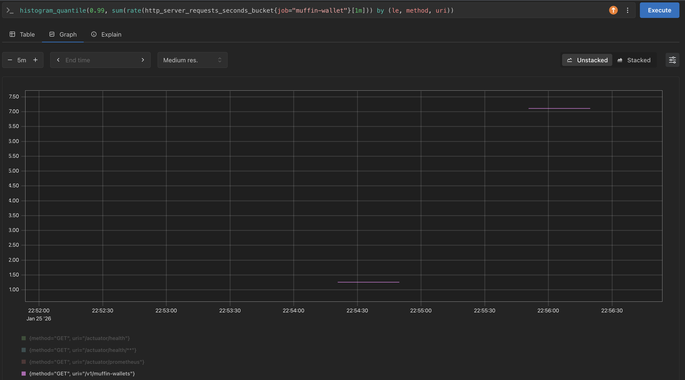

### Количество активных соединений к базе данных PostgreSQL

```promql
sum(pg_stat_activity_count{job="postgres", state="active"})
```

Запрос можно открыть по ссылке [тык](http://localhost:9090/query?g0.expr=sum(pg_stat_activity_count%7Bjob%3D%22postgres%22,+state%3D%22active%22%7D)&g0.show_tree=0&g0.tab=graph&g0.range_input=6h&g0.res_type=auto&g0.res_density=medium&g0.display_mode=lines&g0.y_axis_min=&g0.show_exemplars=0)

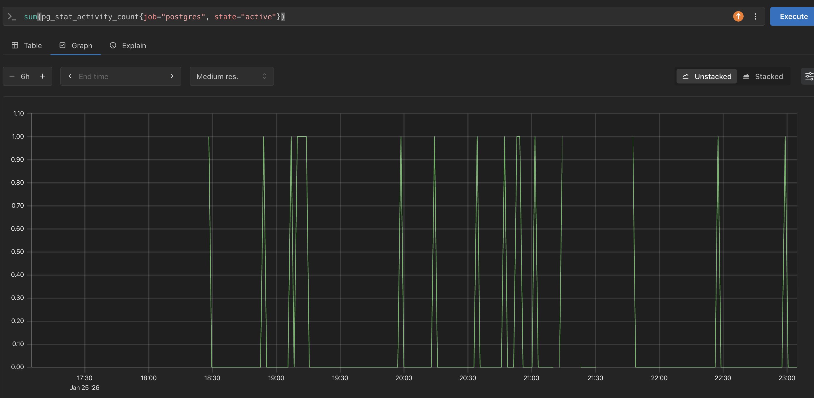

Время открытия соединений соответствует времени, когда я совершал запросы требующие обращение к базе данных

### Общий запрос всех метрик

Собрал все требуюемые метрики по одной ссылке [тык](http://localhost:9090/query?g0.expr=sum(rate(http_server_requests_seconds_count%7Bjob%3D%22muffin-wallet%22%7D%5B1m%5D))+by+(method,+uri)&g0.show_tree=0&g0.tab=graph&g0.range_input=15m&g0.res_type=auto&g0.res_density=medium&g0.display_mode=lines&g0.y_axis_min=&g0.show_exemplars=0&g1.expr=sum(increase(logback_events_total%7Bjob%3D%22muffin-wallet%22,level%3D%22error%22%7D%5B1m%5D))&g1.show_tree=0&g1.tab=graph&g1.range_input=1h&g1.res_type=auto&g1.res_density=medium&g1.display_mode=lines&g1.y_axis_min=&g1.show_exemplars=0&g2.expr=sum(rate(http_server_requests_seconds_count%7Bjob%3D%22muffin-wallet%22,+status%3D~%225..%22%7D%5B1m%5D))&g2.show_tree=0&g2.tab=graph&g2.range_input=1h&g2.res_type=auto&g2.res_density=medium&g2.display_mode=lines&g2.y_axis_min=&g2.show_exemplars=0&g3.expr=histogram_quantile(0.99,+sum(rate(http_server_requests_seconds_bucket%7Bjob%3D%22muffin-wallet%22%7D%5B1m%5D))+by+(le,+method,+uri))&g3.show_tree=0&g3.tab=graph&g3.range_input=1h&g3.res_type=auto&g3.res_density=medium&g3.display_mode=lines&g3.y_axis_min=&g3.show_exemplars=0&g4.expr=sum(pg_stat_activity_count%7Bjob%3D%22postgres%22,+state%3D%22active%22%7D)&g4.show_tree=0&g4.tab=graph&g4.range_input=1h&g4.res_type=auto&g4.res_density=medium&g4.display_mode=lines&g4.y_axis_min=&g4.show_exemplars=0)

### Просмотр метрик в VictoriaMetrics

Т.к. подключено еще и постоянное хранилище метрик, то все метрики доступны и там

К ней можно получить доступ по ссылке [http://localhost:8428/](http://localhost:8428/)

и WebUI: [тык](http://localhost:8428/vmui/?#/?g0.range_input=30m&g0.end_input=2026-01-25T20%3A18%3A31&g0.relative_time=last_30_minutes&g0.tab=0)


Пример результата требуемой метрики 99-й перцентиль времени ответа HTTP (обработка запросов)

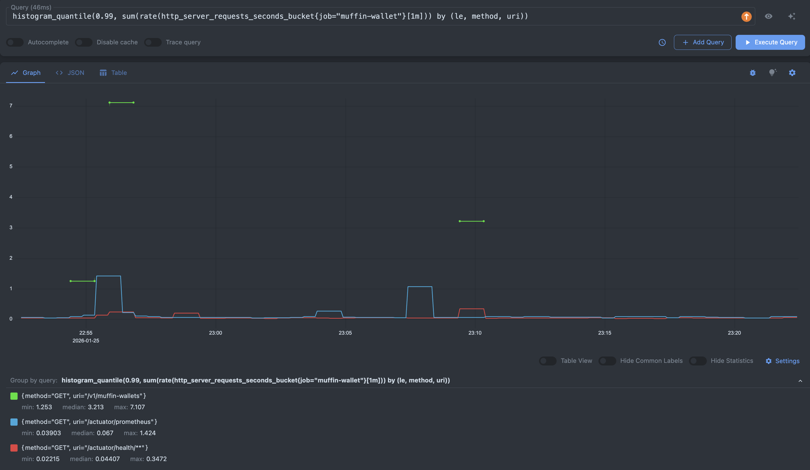
